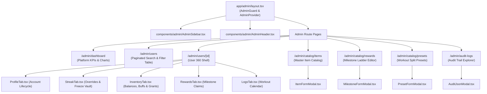

# Gym-Git Admin Panel: Phase-by-Phase Implementation Blueprint (`CREATE_ADMIN.md`)

> **Document Version:** 1.0.0  
> **Target Framework:** Next.js 16 (App Router) / React 19 / TypeScript (Strict)  
> **Backend Architecture:** Go 1.22+ / Gin REST API (`http://localhost:8080/api/v1`)  
> **Authentication:** Supabase Auth (`@supabase/ssr`) with RBAC (`user` | `admin` | `superadmin`)  
> **Design System:** Cyber-Fitness Neon Dark Theme (Tailwind CSS v4 `@theme inline`, Radix UI, Lucide Icons)  
> **Reference Document:** [API_GUIDE.md](file:///c:/Users/salma/Development/Jiyu/CodingAgent/gymgit/frontend/API_GUIDE.md)

---

## 1. Executive Summary & Architectural Overview

The Gym-Git Admin Panel is an internal command center designed for platform administrators and super administrators to monitor platform health, inspect and manage user accounts, oversee gamification economics (item catalog, reward roadmaps, streak freeze vault), perform administrative overrides, and inspect immutable audit trail logs.

### Core Objectives
1. **Strict RBAC Enforcement:** Secure route access via Next.js Middleware and client-side `AdminGuard` querying `/api/v1/admin/auth/verify`. Differentiate permissions between `admin` and `superadmin` (e.g. role promotion, account purging).
2. **Comprehensive Platform Observability:** High-level platform KPIs, streak distribution brackets, split popularity, and top consumed gamification items via `/api/v1/admin/analytics/dashboard`.
3. **User 360 Command Center:** Deep composite profile inspection (`/admin/users/[id]`) with dedicated tabs for Account Settings, Streak & Ice Pause controls, Inventory Balances & Timed Buffs, Milestone Claims, and Workout History.
4. **Gamification & Economy Authoring:** Full CRUD tooling for Master Items Catalog (`/admin/catalog/items`), Dynamic Streak Reward Roadmaps & Milestones (`/admin/catalog/rewards`), and Preset Workout Split Templates (`/admin/catalog/presets`).
5. **Immutable Audit Trail:** Paginated audit log explorer with rich metadata JSON inspector and multi-dimensional filtering.
6. **Seamless Aesthetic Integration:** High-octane cyber-fitness dark aesthetic (`bg-zinc-950`, glassmorphic cards, neon green/cyan/purple accents, rarity badges) matching the core Gym-Git athlete experience.

---

## 2. Directory & Route Architecture Blueprint

```text
frontend/
├── app/
│   ├── admin/
│   │   ├── layout.tsx                     # Global Admin Shell (Sidebar, Topbar, AdminGuard, Breadcrumbs)
│   │   ├── page.tsx                       # Default route (Redirects to /admin/dashboard)
│   │   ├── dashboard/
│   │   │   └── page.tsx                   # Platform Analytics & KPI Overview
│   │   ├── users/
│   │   │   ├── page.tsx                   # Paginated User Directory & Filter Matrix
│   │   │   └── [id]/
│   │   │       ├── page.tsx               # User 360 Shell & Composite Header
│   │   │       ├── tabs/
│   │   │       │   ├── ProfileTab.tsx     # Profile, Status & Role Lifecycle
│   │   │       │   ├── StreakTab.tsx      # Streak Overrides & Freeze Controls
│   │   │       │   ├── InventoryTab.tsx   # Item Balances, Grant/Deduct & Buffs
│   │   │       │   ├── RewardsTab.tsx     # Roadmap Milestone Claim History & Overrides
│   │   │       │   └── LogsTab.tsx        # Workout History Calendar & Reset Demo
│   │   │       └── components/            # User 360 Modals & Action Drawers
│   │   ├── catalog/
│   │   │   ├── items/
│   │   │   │   ├── page.tsx               # Master Item Catalog Management Table
│   │   │   │   └── components/            # Create/Edit Item Modal & Rarity Selectors
│   │   │   ├── rewards/
│   │   │   │   ├── page.tsx               # Roadmap Plans & Milestone Ladder Editor
│   │   │   │   └── components/            # Milestone Upsert Modal & Plan Drawer
│   │   │   └── presets/
│   │   │       ├── page.tsx               # Preset Split Templates Authoring
│   │   │       └── components/            # Split Preset Modal & Category Builder
│   │   └── audit-logs/
│   │       ├── page.tsx                   # Immutable Audit Log Explorer & JSON Inspector
│   │       └── components/                # Audit Filter Bar & JSON Payload Viewer
│   └── ...
├── components/
│   └── admin/
│       ├── AdminGuard.tsx                 # Route Protection & Verification Wrapper
│       ├── AdminSidebar.tsx               # Collapsible Cyberpunk Navigation Sidebar
│       ├── AdminHeader.tsx                # Breadcrumbs, Admin Identity & Timezone Indicator
│       ├── ui/
│       │   ├── AdminDataTable.tsx         # Reusable Paginated & Sortable Table Component
│       │   ├── AdminStatCard.tsx          # Glassmorphic KPI Metric Display Card
│       │   ├── AdminStatusBadge.tsx       # Color-coded Status & Role Pill Badges
│       │   ├── AdminConfirmModal.tsx      # Dangerous Action Confirmation Modal
│       │   ├── AdminJsonViewer.tsx        # Expandable Syntax-Highlighted JSON Viewer
│       │   ├── AdminPagination.tsx        # Universal Server-Side Pagination Bar
│       │   └── AdminEmptyState.tsx        # Themed Empty State Placeholder
├── lib/
│   ├── admin-service.ts                   # Strongly Typed API Client for all /admin/* endpoints
│   ├── admin-types.ts                     # TypeScript DTOs & Interfaces matching API_GUIDE.md
│   └── admin-context.tsx                  # Global Admin Session & Permissions Context
```

---

## 3. Phase-by-Phase Implementation Plan

---

### Phase 1: Foundations, Types, Admin API Client & RBAC Security Layer

#### Goal
Establish the strict TypeScript type definitions, centralized backend admin API service, global admin context, and robust RBAC authentication guards before creating any UI views.

#### Tasks & Implementation Details

1. **Create TypeScript Domain Models & DTOs (`lib/admin-types.ts`):**
   - `AdminAuthVerifyResponse`: `user_id`, `email`, `name`, `role: "admin" | "superadmin"`, `status`, `permissions`.
   - `AdminDashboardAnalytics`: `total_users`, `active_users_7d`, `active_users_30d`, `total_workouts_logged`, `total_rewards_claimed`, `streak_distribution`, `popular_workout_types`, `top_used_items`.
   - `AdminUserListItem`, `AdminUserDetail`, `AdminUserStreakDetail`, `AdminUserInventoryResponse`, `AdminUserActiveEffectDTO`.
   - `AdminAuditLog` with query filter params interface.
   - Catalog DTOs: `Item`, `CreateItemRequest`, `RewardPlan`, `UpsertMilestoneRequest`, `PresetPlan`, `CreatePresetPlanRequest`.
   - Action mutation payloads: `AdminGrantInventoryRequest`, `AdminStreakOverrideRequest`, `AdminStreakFreezeRequest`, `AdminUpdateUserProfileRequest`, `AdminUpdateUserStatusRequest`, `AdminUpdateUserRoleRequest`.

2. **Build Centralized Admin Service Layer (`lib/admin-service.ts`):**
   - Leverage the existing `apiFetch` from `utils/api.ts` with automatic Supabase JWT attachment and `X-Timezone` header injection.
   - Export standard domain methods:
     - **Auth:** `verifyAdminSession()`
     - **Analytics:** `getDashboardAnalytics()`
     - **Audit Logs:** `getAuditLogs(params: AdminAuditLogQueryParams)`
     - **Catalog Items:** `getItems()`, `createItem(data)`, `updateItem(id, data)`, `deleteItem(id)`
     - **Catalog Rewards:** `getRewardPlans()`, `getRewardPlan(id)`, `createRewardPlan(data)`, `updateRewardPlan(id, data)`, `deleteRewardPlan(id)`, `upsertMilestone(planId, data)`, `deleteMilestone(planId, milestoneId)`
     - **Catalog Presets:** `getPresetPlans()`, `createPresetPlan(data)`, `updatePresetPlan(id, data)`, `deletePresetPlan(id)`
     - **Users:** `getUsers(params)`, `getUserDetail(id)`, `updateUserProfile(id, data)`, `updateUserStatus(id, data)`, `updateUserRole(id, data)`, `resetUserDemo(id)`, `purgeUser(id)`
     - **User Sub-resources:** `getUserInventory(id)`, `grantUserInventory(id, data)`, `deductUserInventory(id, data)`, `getUserStreak(id)`, `overrideUserStreak(id, data)`, `freezeUserStreak(id, data)`, `unfreezeUserStreak(id)`, `getUserEffects(id)`, `grantUserEffect(id, data)`, `revokeUserEffect(id, effectId)`, `getUserRewardClaims(id)`, `grantUserMilestoneClaim(id, data)`, `revokeUserMilestoneClaim(id, claimId)`.

3. **Build Admin RBAC Guard & Context (`components/admin/AdminGuard.tsx` & `lib/admin-context.tsx`):**
   - `AdminContext`: Provides `adminUser`, `isSuperAdmin`, `permissions`, `refreshAdminSession()`.
   - `AdminGuard`: Wraps `/admin/*` routes. Validates credentials against `GET /api/v1/admin/auth/verify`.
   - Handles loading with `CyberpunkLoader`, redirects unauthorized users to `/login?error=admin_unauthorized`, and displays a restricted banner if the admin account is suspended or banned.

4. **Update Middleware & Route Matchers (`utils/supabase/middleware.ts` / `proxy.ts`):**
   - Ensure `/admin` and `/admin/:path*` are included in the protected route verification logic.

---

### Phase 2: Cyberpunk Admin Shell, Navigation & Core UI Primitives

#### Goal
Build the unified layout frame and reusable data display components adhering to Gym-Git's dark cyber-fitness design language.

#### Tasks & Implementation Details

1. **Admin Root Layout (`app/admin/layout.tsx`):**
   - Wrap children in `AdminGuard` and `AdminProvider`.
   - Grid layout featuring a fixed collapsible sidebar, sticky top header bar, and main scrollable content area with background ambient glows.

2. **Collapsible Admin Sidebar Navigation (`components/admin/AdminSidebar.tsx`):**
   - Navigation links with active route highlighting:
     - 📊 **Dashboard:** `/admin/dashboard`
     - 👥 **Users:** `/admin/users`
     - 📦 **Items Catalog:** `/admin/catalog/items`
     - 🏆 **Reward Roadmaps:** `/admin/catalog/rewards`
     - 📋 **Preset Splits:** `/admin/catalog/presets`
     - 📜 **Audit Logs:** `/admin/audit-logs`
     - 🏋️ **Exit to Athlete App:** `/dashboard`
   - SuperAdmin badge indicator for elevated callers.
   - Quick collapse/expand toggle state persisted in `localStorage`.

3. **Admin Topbar & Breadcrumbs (`components/admin/AdminHeader.tsx`):**
   - Dynamic path breadcrumbs (e.g. `Admin / Users / John Doe (UUID)`).
   - Current admin identity pill (`name`, `role`, avatar).
   - Live localized IANA timezone badge (`X-Timezone: America/New_York`).
   - Quick sign-out button.

4. **Reusable Core Admin UI Primitives (`components/admin/ui/`):**
   - **`AdminDataTable.tsx`:** Generic typed table supporting server-side sorting, column rendering, loading skeletons, selection, and pagination.
   - **`AdminStatCard.tsx`:** Metric card with neon gradient border, icon, primary metric number, trend indicator, and optional subtitle.
   - **`AdminStatusBadge.tsx`:** Visual badges for statuses (`active` -> green, `suspended` -> yellow, `banned` -> red) and roles (`superadmin` -> purple glow, `admin` -> cyan, `user` -> slate).
   - **`AdminConfirmModal.tsx`:** High-stakes action confirmation dialog with typed confirmation input (e.g. type `CONFIRM` or `DELETE` for irreversible mutations).
   - **`AdminJsonViewer.tsx`:** Collapsible syntax-highlighted JSON viewer with copy-to-clipboard button.
   - **`AdminPagination.tsx`:** Paginated page jumper with limit selector (10, 20, 50, 100).
   - **`AdminEmptyState.tsx`:** Cyberpunk empty state with action button.

5. **Admin Root Redirect (`app/admin/page.tsx`):**
   - Automatically redirects `/admin` to `/admin/dashboard`.

---

### Phase 3: Platform Analytics Dashboard (`/admin/dashboard`)

#### Goal
Provide real-time observability over platform usage, workout logging activity, streak health distributions, split template usage, and item consumption.

#### Tasks & Implementation Details

1. **Dashboard Page Component (`app/admin/dashboard/page.tsx`):**
   - Fetch metrics from `GET /api/v1/admin/analytics/dashboard` on load with auto-refresh capability.

2. **Top Metric KPI Strip:**
   - 4-Card Hero Grid:
     - 👥 **Total Registered Users** (with 7d & 30d active user badges)
     - 🏋️ **Total Workouts Logged**
     - 🏆 **Total Rewards Claimed**
     - ⚡ **Platform Activity Rate** (Ratio of 7d active / total users)

3. **Streak Bracket Distribution Chart:**
   - Visual distribution bar/histogram rendering user breakdown across streak cohorts:
     - `0 Days` (Cold / Broken)
     - `1–6 Days` (Cycle 1 Builders)
     - `7–13 Days` (Week 1 Achievers)
     - `14–29 Days` (Consistent Athletes)
     - `30–59 Days` (Veteran Tier)
     - `60–89 Days` (Elite Tier)
     - `90+ Days` (Special Grade / Titans)
   - Visual percentage indicators and total athlete counts per cohort.

4. **Popular Workout Splits & Item Consumption:**
   - **Popular Workout Split Types:** Ranked breakdown list (e.g. `Push`, `Pull`, `Legs`, `Upper Body`, `Full Body`) with volume counts and proportion bars.
   - **Top Used Gamification Items:** Leaderboard of most consumed items (e.g. `RESTORE_SHIELD`, `STREAK_FREEZE_TOKEN`, `XP_BOOST`) with item icons, rarity badges, and total usage count.

5. **Quick Administration Action Hub:**
   - Quick jump buttons to create items, inspect audit logs, or search users.

---

### Phase 4: Global Gamification & Preset Split Catalog Management

#### Goal
Equip administrators with full authoring capabilities over consumable items, dynamic streak reward roadmap ladders, and system preset workout templates.

#### Tasks & Implementation Details

1. **Master Items Catalog (`app/admin/catalog/items/page.tsx`):**
   - **Data View:** Grid/Table of all master items (`GET /api/v1/admin/items`).
   - Columns: Item ID, Icon/Badge, Name, Effect Type (`instant_use` vs `time_based`), Duration (seconds formatted to human time), Active Status, Actions.
   - **Create / Edit Item Modal (`ItemFormModal.tsx`):**
     - Inputs: Unique ID (uppercase slug), Name, Description, Effect Type selector, Duration input (with presets for 24h, 7d, instant), Icon URL, `is_active` toggle, Custom metadata JSON editor.
   - **Deactivate / Soft-Delete Action:**
     - Toggle item activation state (`PUT /api/v1/admin/items/:id`) or soft-delete (`DELETE /api/v1/admin/items/:id`) with confirm modal.

2. **Reward Roadmaps & Milestone Ladder Editor (`app/admin/catalog/rewards/page.tsx`):**
   - **Roadmap Plans List:** Selector for roadmap plans (e.g. `default-roadmap`, `veteran-roadmap`).
   - **Create/Edit Plan Header:** `POST /api/v1/admin/rewards/plans` and `PUT /api/v1/admin/rewards/plans/:id` (ID, Name, Description, `is_active`).
   - **Visual Milestone Ladder Timeline:**
     - Chronological timeline ordered by `streak_target` (7, 14, 30, 60, 90, 100 days).
     - Each node displays target streak, granted item name/icon, quantity, and metadata badge slug.
   - **Upsert Milestone Modal (`MilestoneFormModal.tsx`):**
     - Add or edit milestone (`POST /api/v1/admin/rewards/plans/:id/milestones`): Streak target number input, Item Catalog dropdown selector, Quantity, Metadata JSON editor.
   - **Delete Milestone Trigger:** Remove milestone (`DELETE /api/v1/admin/rewards/plans/:id/milestones/:milestone_id`).

3. **Preset Workout Split Templates (`app/admin/catalog/presets/page.tsx`):**
   - **Presets Gallery:** Cards displaying all system templates (`GET /api/v1/admin/plans/presets`).
   - Shows template ID, Name, Description, and Category tag pills (e.g. `["Push", "Pull", "Legs", "Rest"]`).
   - **Create / Edit Preset Split Modal (`PresetFormModal.tsx`):**
     - Inputs: ID, Name, Description, Dynamic Category tag builder (Add/remove/reorder tags with drag or pill inputs).
     - Submits `POST /api/v1/admin/plans/presets` or `PUT /api/v1/admin/plans/presets/:id`.
   - **Delete Preset Template Action:** `DELETE /api/v1/admin/plans/presets/:id` with confirmation.

---

### Phase 5: User Directory, Search & Filtering Matrix

#### Goal
Build a high-performance paginated user management table with multi-parameter filtering, searching, and sorting.

#### Tasks & Implementation Details

1. **User Directory Page (`app/admin/users/page.tsx`):**
   - Query backend `GET /api/v1/admin/users` with dynamic query params synced to URL search parameters for link sharing and state preservation.

2. **Filter & Search Bar (`UserFilterBar.tsx`):**
   - **Search Input (Debounced 300ms):** Matches `email`, `name`, User UUID, or Supabase `auth_user_id`.
   - **Role Filter Dropdown:** `All`, `user`, `admin`, `superadmin`.
   - **Status Filter Dropdown:** `All`, `active`, `suspended`, `banned`.
   - **Sort Selector:** Sort by `created_at`, `email`, `name`, `role`, `status`, `current_streak`, `total_workouts`, `updated_at` with `asc`/`desc` toggle.

3. **User Data Table Columns:**
   - **User Info:** Avatar, Name, Email, Auth UUID.
   - **Role & Status:** Status Badge (`active`/`suspended`/`banned`) and Role Badge.
   - **Streak & Activity:** Current streak fire badge, Total logged workouts count.
   - **Timezone & Registration:** User IANA timezone, Created date (relative and formatted).
   - **Row Actions:** Quick link to `View 360 Profile (/admin/users/[id])`, Quick Status toggle modal.

4. **Pagination Controls (`AdminPagination.tsx`):**
   - Server-side page jump buttons with limit selector.

---

### Phase 6: User 360 Profile & Override Command Center (`/admin/users/[id]`)

#### Goal
Provide a comprehensive single-pane-of-glass management view for any athlete, allowing detailed inspection and operational overrides across all domain subsystems.

#### Tasks & Implementation Details

1. **Composite User 360 Shell (`app/admin/users/[id]/page.tsx`):**
   - Load composite details via `GET /api/v1/admin/users/:id` (`user`, `streak_state`, `inventory`, `active_effects`, `total_workouts`, `recent_logs`).
   - **Header Banner:**
     - User Avatar, Display Name, Email, User UUID, Supabase Auth UUID, Timezone badge.
     - Status Badge (`active` / `suspended` / `banned`).
     - Role Badge with **SuperAdmin Promote/Demote Action Button**.
     - **Reset Demo History Action Button** (`POST /api/v1/admin/users/:id/reset-demo`).
     - **SuperAdmin Purge Account Button** (`DELETE /api/v1/admin/users/:id`).
   - **Tabbed Navigation:**
     - 👤 **1. Profile & Account**
     - 🔥 **2. Streak & Ice Pause**
     - 🎒 **3. Inventory & Buffs**
     - 🏆 **4. Roadmap Rewards**
     - 📅 **5. Workout Logs**

2. **Tab 1: Profile & Account Lifecycle (`ProfileTab.tsx`):**
   - **Profile Editor:** Update Name, Timezone, Active Weekly Plan (`PUT /api/v1/admin/users/:id/profile`).
   - **Account Status Management:**
     - Suspend or Ban user modal with mandatory Reason field (`PUT /api/v1/admin/users/:id/status`).
     - Unsuspend/Reactivate action.
   - **SuperAdmin Role Management:**
     - Modal to change role (`user` <-> `admin` <-> `superadmin`) via `PUT /api/v1/admin/users/:id/role`.

3. **Tab 2: Streak State & Freeze Vault ("Ice Pause") (`StreakTab.tsx`):**
   - **Metrics Grid:** Current Streak, Longest Streak, Last Logged Date, Freeze Status, Available Freeze Tokens, Available Restore Shields.
   - **Manual Streak Repair / Override Modal:**
     - Inputs: `current_streak`, `longest_streak`, and mandatory audit `reason` (`PUT /api/v1/admin/users/:id/streak/override`).
   - **Administrative Streak Freeze Hold Modal:**
     - Apply custom administrative freeze for `N` days with medical/support reason (`POST /api/v1/admin/users/:id/streak/freeze`).
   - **Instant Unfreeze Action:**
     - Immediately clear active freeze hold (`POST /api/v1/admin/users/:id/streak/unfreeze`).

4. **Tab 3: Inventory Balances & Active Timed Buffs (`InventoryTab.tsx`):**
   - **Item Balances Grid:** Visual card list of user's consumable items with rarity borders and quantity counters.
   - **Grant Items Modal (`GrantItemModal.tsx`):**
     - Select Item from catalog, enter quantity (positive integer), enter support/audit reason (`POST /api/v1/admin/users/:id/inventory/grant`).
   - **Deduct Items Modal (`DeductItemModal.tsx`):**
     - Select Item, quantity to deduct, audit reason (`POST /api/v1/admin/users/:id/inventory/deduct`).
   - **Active Timed Buffs Table:**
     - Displays active buffs (e.g. `XP_BOOST`), activated at, expires at, remaining seconds live countdown, and cancel button (`DELETE /api/v1/admin/users/:id/effects/:effect_id`).
   - **Grant Timed Buff Modal:**
     - Apply custom duration buff directly to user (`POST /api/v1/admin/users/:id/effects/grant`).

5. **Tab 4: Roadmap Milestone Claims History (`RewardsTab.tsx`):**
   - **Claimed Milestones Table:** List of all claimed rewards (`GET /api/v1/admin/users/:id/rewards/claims`) with plan ID, streak target, item, and claim timestamp.
   - **Force-Grant Milestone Claim Modal:**
     - Unlock milestone for user (`POST /api/v1/admin/users/:id/rewards/claims/grant`).
   - **Revoke Milestone Claim Trigger:**
     - Revoke claim so user can re-claim or repair invalid state (`DELETE /api/v1/admin/users/:id/rewards/claims/:claim_id`).

6. **Tab 5: Workout Logs History Calendar (`LogsTab.tsx`):**
   - **Logs Timeline / Table:** View recent logs (`recent_logs`) with date, workout type, duration hours, and notes.
   - **Quick Demo Reset Action:** Trigger seed workout reset with confirmation.

---

### Phase 7: Immutable Audit Trail & System Log Inspector (`/admin/audit-logs`)

#### Goal
Provide a tamper-proof audit trail table recording all administrative mutations with structured JSON payload viewing.

#### Tasks & Implementation Details

1. **Audit Logs Page (`app/admin/audit-logs/page.tsx`):**
   - Query `GET /api/v1/admin/audit-logs` with server pagination and multi-parameter filters.

2. **Audit Filter Bar (`AuditFilterBar.tsx`):**
   - **Action Filter:** Filter by action code (`INVENTORY_GRANT`, `INVENTORY_DEDUCT`, `STREAK_OVERRIDE`, `STREAK_FREEZE`, `USER_STATUS_UPDATE`, `USER_ROLE_UPDATE`, `ITEM_CREATE`, `ITEM_UPDATE`, `REWARD_GRANT`, `USER_PURGE`).
   - **Target Type Filter:** `USER`, `ITEM`, `REWARD_PLAN`, `PRESET_PLAN`.
   - **Target ID & Admin ID Search:** Match target or performing admin UUID.
   - **Date Range Picker:** `from_date` and `to_date` ISO selectors.

3. **Audit Log Data Table:**
   - **Timestamp:** Formatted localized time and relative time badge.
   - **Admin Identity:** Admin email / ID badge.
   - **Action Type:** Color-coded action pill (Grants: emerald, Overrides: amber, Bans/Purges: rose, Catalog edits: cyan).
   - **Target:** Target type and ID with clickable link if target is a user (`/admin/users/:id`).
   - **Metadata Action:** Button to open structured JSON Inspector Modal.

4. **Audit Metadata JSON Inspector Modal (`AuditJsonModal.tsx`):**
   - Interactive formatted JSON tree showing before/after states, reasons, and mutation params.

---

### Phase 8: Verification, Security Testing, Error Handling & Polish

#### Goal
Ensure all admin flows are hardened, permissions are strictly checked, error envelopes are handled gracefully, and production builds pass without errors.

#### Tasks & Implementation Details

1. **RBAC & Security Verification:**
   - Verify non-logged-in users are redirected to `/login`.
   - Verify regular `role: "user"` cannot view `/admin/*` and receive 403 / redirect.
   - Verify `role: "admin"` cannot execute SuperAdmin mutations (`role` change, account `purge`). UI hides or disables these buttons with appropriate tooltips.
   - Verify `role: "superadmin"` has full execution rights across all endpoints.

2. **Error Envelope & Toast Notifications:**
   - Integrate toast notifications on all mutation successes and API error responses.
   - Gracefully display backend error messages (`details`, `error.message`) from `ApiError`.

3. **Code Quality & Build Checks:**
   - Execute TypeScript strict type checking (`npx tsc --noEmit`).
   - Execute Next.js production build (`npm run build`).
   - Execute linter checks (`npm run lint`).

4. **Agent State & Tracking Documentation:**
   - Create `.agent/features/admin-panel/STATE.md` to track progress across future implementation sessions following the repository MOP.

---

## 4. Component Hierarchy & Dependency Graph



---

## 5. Security & Permission Matrix

| Feature / Endpoint | Target Route / Action | `role: "user"` | `role: "admin"` | `role: "superadmin"` |
| :--- | :--- | :---: | :---: | :---: |
| **Admin Route Guard** | `/admin/*` access | ❌ (Redirect 403) | ✅ Allowed | ✅ Allowed |
| **Platform Analytics** | `GET /admin/analytics/dashboard` | ❌ | ✅ Allowed | ✅ Allowed |
| **Audit Logs** | `GET /admin/audit-logs` | ❌ | ✅ Allowed | ✅ Allowed |
| **Catalog Items CRUD** | `/admin/catalog/items` | ❌ | ✅ Allowed | ✅ Allowed |
| **Reward Plans & Milestones**| `/admin/catalog/rewards` | ❌ | ✅ Allowed | ✅ Allowed |
| **Preset Splits CRUD** | `/admin/catalog/presets` | ❌ | ✅ Allowed | ✅ Allowed |
| **User Directory & 360 View**| `GET /admin/users`, `/admin/users/:id` | ❌ | ✅ Allowed | ✅ Allowed |
| **User Profile / Status Update**| `PUT /admin/users/:id/profile`, `/status` | ❌ | ✅ Allowed | ✅ Allowed |
| **User Streak Overrides** | `PUT /admin/users/:id/streak/override` | ❌ | ✅ Allowed | ✅ Allowed |
| **User Freeze / Unfreeze** | `POST /admin/users/:id/streak/freeze` | ❌ | ✅ Allowed | ✅ Allowed |
| **Grant / Deduct Inventory**| `POST /admin/users/:id/inventory/*` | ❌ | ✅ Allowed | ✅ Allowed |
| **Grant / Revoke Effects** | `POST/DELETE /admin/users/:id/effects/*`| ❌ | ✅ Allowed | ✅ Allowed |
| **Grant / Revoke Rewards** | `POST/DELETE /admin/users/:id/rewards/*`| ❌ | ✅ Allowed | ✅ Allowed |
| **Reset Demo History** | `POST /admin/users/:id/reset-demo` | ❌ | ✅ Allowed | ✅ Allowed |
| **Promote / Demote Roles** | `PUT /admin/users/:id/role` | ❌ | ❌ (Forbidden) | ✅ **SuperAdmin Only** |
| **Permanent Account Purge** | `DELETE /admin/users/:id` | ❌ | ❌ (Forbidden) | ✅ **SuperAdmin Only** |

---

## 6. Execution Strategy & Next Steps

When ready to begin coding:
1. **Initialize Phase 1:** Create `lib/admin-types.ts`, `lib/admin-service.ts`, `lib/admin-context.tsx`, and `components/admin/AdminGuard.tsx`.
2. **Execute Sequentially:** Complete each phase sequentially with thorough manual testing and TypeScript verification.
3. **Strict Compliance:** Adhere to the repository's No Ghosting, Context Economy, and Circuit Breaker rules.

