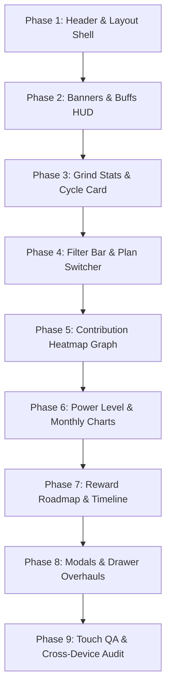

# Gym-Git Dashboard Responsive Design & Mobile Optimization Plan

> **Document Purpose:** Master phase-by-phase execution plan to transition the Gym-Git dashboard from a desktop-centric interface into a fully responsive, mobile-first, and touch-optimized cyberpunk fitness application.  
> **Target Viewports:** Extra Small Mobile (`320px–375px`), Standard Mobile (`375px–428px`), Tablet (`768px–1024px`), Desktop (`1024px–1440px`), and Ultrawide (`1440px+`).  
> **Status:** `Planning & Architectural Review`  
> **Rule Adherence:** Strictly complies with Next.js 16 App Router, Tailwind CSS v4 (`@theme inline`), and `.agent/rules/` specifications.

---

## Table of Contents
1. [Executive Summary & Problem Diagnosis](#1-executive-summary--problem-diagnosis)
2. [Global Responsive Principles & Breakpoint System](#2-global-responsive-principles--breakpoint-system)
3. [Phase-by-Phase Implementation Roadmap](#3-phase-by-phase-implementation-roadmap)
   - [Phase 1: Global Layout Shell, Header & Navigation](#phase-1-global-layout-shell-header--navigation)
   - [Phase 2: Notification Banners, Alerts & Active Buffs HUD](#phase-2-notification-banners-alerts--active-buffs-hud)
   - [Phase 3: Grind Stats & Cycle Progress Architecture](#phase-3-grind-stats--cycle-progress-architecture)
   - [Phase 4: Filter Bar & Activity Protocol Selector](#phase-4-filter-bar--activity-protocol-selector)
   - [Phase 5: Multi-View Contribution Heatmap Graph](#phase-5-multi-view-contribution-heatmap-graph)
   - [Phase 6: Scientific Power Levels & Anime Monthly Charts](#phase-6-scientific-power-levels--anime-monthly-charts)
   - [Phase 7: Streak Reward Roadmap & RPG Milestones](#phase-7-streak-reward-roadmap--rpg-milestones)
   - [Phase 8: Modals, Drawers & Interactive Dialogs](#phase-8-modals-drawers--interactive-dialogs)
   - [Phase 9: Touch Target Ergonomics, Typography Scaling & Viewport QA](#phase-9-touch-target-ergonomics-typography-scaling--viewport-qa)
4. [File Modification Matrix](#4-file-modification-matrix)
5. [Verification & Acceptance Criteria](#5-verification--acceptance-criteria)

---

## 1. Executive Summary & Problem Diagnosis

### Root Causes of Current Mobile Breakages & Text Truncations:
1. **Hardcoded Content Widths & Asset Collisions:**
   - In [StatsOverview.tsx](file:///components/pages/dashboard/StatsOverview.tsx), each card allocates `w-[70%]` or `w-[72%]` to text while the decorative 3D icon occupies `w-[45%]` absolute on the right. On a 2-column mobile layout (<380px per card = ~160px width), text has barely ~100px of space, forcing metrics like `"Wk: 3/4 (On Track)"` and `"20 sessions (~1.5h avg)"` to collide with icons or truncate abruptly.
2. **Fixed Grid Columns without Mobile Fallbacks:**
   - [MonthView.tsx](file:///components/contribution-graph/MonthView.tsx) forces `grid-cols-7` on all screens. On a 360px screen, each tile receives ~42px total width. Inside each tile, day numbers, duration badges (`1.5h`), and protocol names (`"Chest & Triceps"`) are jammed into a fixed `h-16` box, causing extreme text clipping.
   - [MonthlyProgress.tsx](file:///components/pages/dashboard/power-level/MonthlyProgress.tsx) renders 12 vertical bar columns in a single row without horizontal scrolling or compact mobile collapsing. On mobile, columns shrink below 20px, causing anime mascot thumbnails (32px) and score labels to overlap.
3. **Fixed-Size Interactive Controls:**
   - [WorkoutLogForm.tsx](file:///components/pages/dashboard/modals/WorkoutLogForm.tsx) renders an SVG dial with fixed `200x200` dimensions and `my-6` margins. On mobile viewports (<700px height), this forces the modal content beyond the viewport height and clips action buttons.
4. **Header & Navigation Density:**
   - [Header.tsx](file:///components/pages/dashboard/Header.tsx) has a `size-16` (64px) logo and several sibling controls (Inventory bag, User badge, Logout door) that crowd the top bar on narrow devices.
5. **Timeline & Roadmap Overflow Management:**
   - [RewardRoadmap.tsx](file:///components/pages/dashboard/rewards/RewardRoadmap.tsx) uses a `min-w-[1050px]` horizontal timeline without mobile swipe affordances, visual edge fade masks, or mobile popover positioning guards.
6. **Modal Viewport Clamping & Scroll Locks:**
   - [ModalShell.tsx](file:///components/ui/modal-shell.tsx) uses `p-6 sm:p-7` padding, which consumes ~20% of screen width on 320px–375px devices, squeezing forms and multi-step wizards.

---

## 2. Global Responsive Principles & Breakpoint System

### Tailwind CSS v4 Responsive Tier Standard:
* **`xs` (< 400px):** Ultra-compact mobile (iPhone SE, Galaxy Z Flip cover, small Android devices). Single-column layouts, condensed icons, minimal padding (`p-2.5` to `p-3`), abbreviation of non-critical labels.
* **`sm` (640px):** Large mobile / Phablet (iPhone Pro Max, Pixel XL). 2-column stat grids, horizontal chip rails.
* **`md` (768px):** Tablets / Foldables unfolded. Hybrid 2-to-3 column layouts, expanded modal views.
* **`lg` (1024px):** Laptops & Standard Desktops. Full 4-column metric grids, side-by-side power chart split.
* **`xl` (1280px+):** Large monitors & Ultrawide. Max-width container wrapping (`max-w-7xl` / `max-w-8xl`).

### Core Engineering Rules for Mobile Responsiveness:
1. **Container Flexibility First:** Replace fixed pixel widths with `w-full`, `min-w-0`, `flex-1`, and `max-w-full`.
2. **Defensive Text Layout:** Every text container must have `min-w-0` when placed inside a flex row to enable natural ellipsis or wrapping without pushing siblings offscreen.
3. **Touch Target Standard (WCAG 2.5.5):** All clickable elements, pills, and interactive heatmap tiles must provide at least a `44x44px` interactive touch target area (or padding buffer).
4. **Fluid Typography:** Scale headings and metric numbers smoothly (`text-2xl sm:text-3xl lg:text-4xl`) rather than large static sizes.
5. **Horizontal Scroll Containment:** Any component that requires horizontal scrolling ([YearView](file:///components/contribution-graph/YearView.tsx), [RewardRoadmap](file:///components/pages/dashboard/rewards/RewardRoadmap.tsx)) must feature gradient edge masking (`mask-image`), momentum scrolling (`-webkit-overflow-scrolling: touch`), and explicit visual cues (swipe arrows/scroll indicators).

---

## 3. Phase-by-Phase Implementation Roadmap



---

### Phase 1: Global Layout Shell, Header & Navigation
**Target Files:**
- [app/dashboard/page.tsx](file:///app/dashboard/page.tsx)
- [components/pages/dashboard/Header.tsx](file:///components/pages/dashboard/Header.tsx)
- [components/layout/Footer.tsx](file:///components/layout/Footer.tsx)

**Key Tasks:**
1. **Dashboard Container Padding Calibration:**
   - Update `<main>` in `app/dashboard/page.tsx` from `p-4 sm:p-6 lg:p-8 space-y-8` to `px-3 py-4 sm:p-6 lg:p-8 space-y-5 sm:space-y-8` to reclaim 16px of horizontal screen width on mobile devices.
2. **Header Brand Scaling & Spacing:**
   - Scale logo from `size-16` (64px) down to `size-10 sm:size-12 lg:size-16` on mobile.
   - Adjust `Gym-Git` title font size: `text-base sm:text-lg lg:text-xl font-black`.
   - Ensure header container uses `px-3 sm:px-4 lg:px-8 py-2.5 sm:py-3`.
3. **Mobile User Profile & Action Controls:**
   - Inventory icon button: Increase mobile hit box (`w-9 h-9 flex items-center justify-center`) while keeping icon clean (`size-6 sm:size-7`).
   - Profile badge: On `< lg`, render user avatar as a sleek circular badge (`w-8 h-8`) with active status dot; hide email and long name without clipping.
   - Logout button: Keep compact square door button with clear touch target (`w-8 h-8 sm:w-9 sm:h-9`).
4. **Footer Mobile Stacking:**
   - Ensure footer links and credits wrap smoothly without text overflowing mobile screen edges.

---

### Phase 2: Notification Banners, Alerts & Active Buffs HUD
**Target Files:**
- [components/pages/dashboard/banners/StreakRiskWarningBanner.tsx](file:///components/pages/dashboard/banners/StreakRiskWarningBanner.tsx)
- [components/pages/dashboard/banners/streakbanner.css](file:///components/pages/dashboard/banners/streakbanner.css)
- [components/pages/dashboard/banners/FrozenStateBanner.tsx](file:///components/pages/dashboard/banners/FrozenStateBanner.tsx)
- [components/inventory/ActiveEffectsBar.tsx](file:///components/inventory/ActiveEffectsBar.tsx)
- [components/pages/dashboard/toolbar/MockTestingToolbar.tsx](file:///components/pages/dashboard/toolbar/MockTestingToolbar.tsx)

**Key Tasks:**
1. **Anime Mascot Speech Bubble Refactor:**
   - In `StreakRiskWarningBanner.tsx`, adjust avatar container on mobile from `w-16 h-16` to `w-12 h-12 sm:w-16 sm:h-16`.
   - Update speech bubble typography: Quote text `text-xs sm:text-sm font-medium`, contextual countdown `text-[11px] sm:text-xs`.
   - Action buttons row: Refactor into responsive stacked or 2-column layout (`flex flex-col sm:flex-row gap-2 sm:gap-3`), ensuring `"Log Workout Now"` remains primary and high-contrast.
2. **Ice Pause Frozen Banner Mobile Alignment:**
   - In `FrozenStateBanner.tsx`, adjust header row to wrap badges (`ICE PAUSE ACTIVE`, countdown timer) cleanly with `flex-wrap gap-1.5`.
   - Set title to `text-sm sm:text-base font-black` and description to `text-xs leading-relaxed`.
   - Action buttons (`"Resume Streak"` / `"Confirm Resume"`): Full width on mobile (`w-full sm:w-auto`), preserving tactile feedback.
3. **Active Buffs HUD Chip Rail:**
   - In `ActiveEffectsBar.tsx`, replace the rigid `border-r` separator with a flexible badge on mobile.
   - Format effect chips with `text-[9px] sm:text-[10px]` and truncate item names cleanly if timers tick down.
4. **Mock Testing Toolbar Collapse on Mobile:**
   - Add a mobile accordion toggle to collapse the 5 testing buttons on screens `< 640px`, keeping the main dashboard view uncluttered.

---

### Phase 3: Grind Stats & Cycle Progress Architecture
**Target Files:**
- [components/pages/dashboard/StatsOverview.tsx](file:///components/pages/dashboard/StatsOverview.tsx)
- [components/pages/dashboard/CycleProgressCard.tsx](file:///components/pages/dashboard/CycleProgressCard.tsx)

**Key Tasks:**
1. **StatCard Layout Overhaul (Fixing the 70% Width Collision):**
   - In `StatCard`, replace static `contentWidth = "w-[70%]"` with a dynamic responsive grid or relative layer:
     - On mobile screens (`< 640px`): Render text in front with higher z-index and reduce the background icon opacity to `opacity-20` (or place icon in the top-right corner with `w-8 h-8` compact size) to guarantee 100% readable text width.
     - On desktop (`>= 640px`): Restore the side-by-side cyber icon styling (`w-[82px]`).
   - Value and Unit typography: Scale metric number from `text-4xl` to `text-2xl sm:text-3xl lg:text-4xl font-black` to prevent multi-line number breaks (e.g., `100%`, `365d`).
   - Subtext typography: Use `text-[9.5px] sm:text-[11px] leading-tight` and add `truncate` or structured 2-line clamping.
2. **Grind Stats Section Header:**
   - On `< 400px` screens, shorten horizontal neon decorative lines so the central `"GRIND STATS"` pill does not get squeezed.
3. **CycleProgressCard Mobile Refactor:**
   - **Panel 1 (Cycle Range):** Stack start/end dates and `"Days Remaining"` badge vertically on mobile (`flex-col sm:flex-row items-start sm:items-center`).
   - **Panel 2 (Workout Progress):** Segmented bars: Ensure `h-3.5 sm:h-5` with `gap-1` so that 4–6 workout segment blocks fit on 320px screens.
   - **Panel 3 (Rest Tokens):** Hardware battery pods: Scale Zap icon to `w-2.5 h-2.5 sm:w-3.5 h-3.5` on mobile.
   - **Panel 4 (Diagnostics Radar):** Center the circular SVG on mobile (`w-20 h-20 sm:w-24 sm:h-24`), adjusting inner radius and font sizes (`text-base sm:text-lg`).
   - **Queued Plan Banner:** Full width with `break-words` for custom split names.

---

### Phase 4: Filter Bar & Activity Protocol Selector
**Target Files:**
- [components/pages/dashboard/FilterBar.tsx](file:///components/pages/dashboard/FilterBar.tsx)

**Key Tasks:**
1. **Header & Active Plan Label:**
   - Mobile alignment: Stack `"Filter Activity:"` and plan badge into a clean top row.
   - Plan badge: Show compact plan name with icon (`Calendar`) on mobile instead of hiding completely.
2. **Scrollable Protocol Chip Rail vs Responsive Flex Wrap:**
   - Implement an intelligent horizontal swipeable chip list on mobile with subtle left/right fade masks (`overflow-x-auto no-scrollbar sm:flex-wrap`).
   - Category buttons: Reduce padding on mobile to `px-2.5 py-1 text-[11px] sm:px-4 sm:py-1.5 sm:text-xs`.
3. **Plan Configuration Button:**
   - Keep `"Plan"` settings button pinned to the right edge or integrated into the filter bar header for instant 1-tap access on mobile.

---

### Phase 5: Multi-View Contribution Heatmap Graph
**Target Files:**
- [components/pages/dashboard/ContributionGraph.tsx](file:///components/pages/dashboard/ContributionGraph.tsx)
- [components/contribution-graph/ContributionGraphHeader.tsx](file:///components/contribution-graph/ContributionGraphHeader.tsx)
- [components/contribution-graph/YearView.tsx](file:///components/contribution-graph/YearView.tsx)
- [components/contribution-graph/MonthView.tsx](file:///components/contribution-graph/MonthView.tsx)
- [components/contribution-graph/WeekView.tsx](file:///components/contribution-graph/WeekView.tsx)
- [components/contribution-graph/DayTileTooltip.tsx](file:///components/contribution-graph/DayTileTooltip.tsx)

**Key Tasks:**
1. **ContributionGraphHeader Mobile Toggles:**
   - Toggles container: Switch from fixed-width row to full-width segmented control on mobile (`w-full sm:w-auto grid grid-cols-3 sm:flex`).
   - Toggle buttons: `px-2 py-1 text-[9px] sm:px-4 sm:py-1.5 sm:text-[10px]`. Replace `"365 Days"` with `"Year"` on ultra-small screens (`< 380px`).
   - Activity log summary sentence: Shorten cleanly on mobile (e.g. `210 sessions (315.5h) • 2026`).
2. **YearView Horizontal Scroll Container & Affordance:**
   - Add left & right gradient fade indicators (`pointer-events-none`) when scrolled.
   - Smooth touch scroll: `-webkit-overflow-scrolling: touch; scrollbar-width: none;`.
   - Legend bar: On mobile, wrap `"Less ... More"` swatches neatly or position below the scroll container.
3. **MonthView Grid & Tile Overhaul (Crucial Text Cutoff Fix):**
   - Header days row (`Sun..Sat`): Use 1-letter or 2-letter labels on mobile (`S, M, T, W, T, F, S` on `< 480px`, `Sun, Mon...` on `>= 480px`).
   - Tile dimensions & layout:
     - On mobile (`< 640px`): Adjust height to `h-13 sm:h-16`, padding `p-1 sm:p-2`.
     - Day number: `text-[10px] sm:text-xs font-black`.
     - Duration pill: `text-[7.5px] px-1 py-0.2 sm:text-[9px] sm:px-1.5 sm:py-0.5`.
     - Protocol label: Hide long text string on `< 400px` and rely on the vivid theme color border, bottom accent bar, and tap tooltip; show truncated text on `>= 400px`.
4. **WeekView Mobile Card Layout:**
   - On mobile screens (`< 640px`): Instead of giant 160px tall stacked blocks that consume entire viewports, use a compact horizontal card format or structured 7-column swipeable view with `h-24 sm:h-40`, clean hours readout (`2.0h`), and protocol tag.
5. **Touch-Friendly Tooltips on Mobile:**
   - Support tap-to-inspect on mobile without triggering navigation or double-click glitches.

---

### Phase 6: Scientific Power Levels & Anime Monthly Charts
**Target Files:**
- [components/pages/dashboard/PowerLevelChart.tsx](file:///components/pages/dashboard/PowerLevelChart.tsx)
- [components/pages/dashboard/power-level/WeeklyProgress.tsx](file:///components/pages/dashboard/power-level/WeeklyProgress.tsx)
- [components/pages/dashboard/power-level/MonthlyProgress.tsx](file:///components/pages/dashboard/power-level/MonthlyProgress.tsx)
- [components/pages/dashboard/AnimeTierCard.tsx](file:///components/pages/dashboard/AnimeTierCard.tsx)
- [components/pages/dashboard/modals/PowerScoreGuideModal.tsx](file:///components/pages/dashboard/modals/PowerScoreGuideModal.tsx)

**Key Tasks:**
1. **PowerLevelChart Container & Header:**
   - Header: Responsive flex layout stacking title and `"Score Guide"` trigger cleanly.
   - Chart sections: `flex-col lg:flex-row gap-6`.
2. **WeeklyProgress Scaling:**
   - Week labels: Format as `W1`, `W2`, `W3`, `W4` or `M/D` on small screens to eliminate label cut-offs.
   - Mascot avatars: `w-6 h-6 sm:w-8 sm:h-8 sm:w-10 sm:h-10`.
   - Score readout: `text-[10px] sm:text-xs font-black`.
3. **MonthlyProgress 12-Month Bar Chart Overhaul:**
   - Problem: 12 bars on a 320px screen leave ~18px per column, causing mascot avatars and score numbers to overlap.
   - Solution:
     - On mobile (`< 640px`): Enable horizontal scrolling chart container with sticky header or show the last 6 months by default with a toggle to view all 12.
     - Mascot thumbnails: Scale to `w-5 h-5 sm:w-7 sm:h-7 sm:w-10 sm:h-10`.
     - Month names: 1-letter abbreviations (`J, F, M, A...`) on ultra-small mobile if rendered in single view, or 3-letter (`Jan, Feb...`) inside scroll container.
4. **AnimeTierCard Mobile Tooltip / Popover Constraints:**
   - In `AnimeTierCard.tsx`, ensure max width does not exceed `min(300px, 90vw)` and stats breakdown table stacks cleanly.

---

### Phase 7: Streak Reward Roadmap & RPG Milestones
**Target Files:**
- [components/pages/dashboard/rewards/RewardRoadmap.tsx](file:///components/pages/dashboard/rewards/RewardRoadmap.tsx)
- [components/pages/dashboard/rewards/RoadmapMilestoneNode.tsx](file:///components/pages/dashboard/rewards/RoadmapMilestoneNode.tsx)

**Key Tasks:**
1. **Roadmap Header:**
   - Title, subtitle, and `"Longest Streak: Xd"` badge: Stack smoothly on mobile (`flex-col sm:flex-row items-start sm:items-center`).
2. **Horizontal Timeline Touch Experience:**
   - Ensure the `overflow-x-auto` timeline container has smooth touch inertia and left/right gradient masking.
   - Milestone cards: Maintain minimum touch width (`w-[160px] sm:w-[200px]`), adjust card padding `p-3 sm:p-4`, and ensure claim buttons are touch-friendly (`min-h-[38px]`).
3. **Mobile Popover Inspection:**
   - Prevent milestone rarity tooltips from clipping off the left/right screen edges when tapping nodes near the edge of the viewport.

---

### Phase 8: Modals, Drawers & Interactive Dialogs
**Target Files:**
- [components/ui/modal-shell.tsx](file:///components/ui/modal-shell.tsx)
- [components/pages/dashboard/modals/DailyCheckInModal.tsx](file:///components/pages/dashboard/modals/DailyCheckInModal.tsx)
- [components/pages/dashboard/modals/checkin/CheckInPromptStep.tsx](file:///components/pages/dashboard/modals/checkin/CheckInPromptStep.tsx)
- [components/pages/dashboard/modals/checkin/AnimeCheckInCutscene.tsx](file:///components/pages/dashboard/modals/checkin/AnimeCheckInCutscene.tsx)
- [components/pages/dashboard/modals/WorkoutLogForm.tsx](file:///components/pages/dashboard/modals/WorkoutLogForm.tsx)
- [components/pages/dashboard/modals/EditLogModal.tsx](file:///components/pages/dashboard/modals/EditLogModal.tsx)
- [components/pages/dashboard/modals/WeeklyPlanModal.tsx](file:///components/pages/dashboard/modals/WeeklyPlanModal.tsx)
- [components/pages/dashboard/weekly-plan/PlanFrequencyStep.tsx](file:///components/pages/dashboard/weekly-plan/PlanFrequencyStep.tsx)
- [components/pages/dashboard/weekly-plan/DayScheduleStep.tsx](file:///components/pages/dashboard/weekly-plan/DayScheduleStep.tsx)
- [components/inventory/InventoryDrawer.tsx](file:///components/inventory/InventoryDrawer.tsx)
- [components/pages/dashboard/modals/FreezeModal.tsx](file:///components/pages/dashboard/modals/FreezeModal.tsx)
- [components/pages/dashboard/modals/StreakBrokenModal.tsx](file:///components/pages/dashboard/modals/StreakBrokenModal.tsx)
- [components/pages/dashboard/modals/RestoreConfirmModal.tsx](file:///components/pages/dashboard/modals/RestoreConfirmModal.tsx)
- [components/pages/dashboard/rewards/ClaimCelebrationModal.tsx](file:///components/pages/dashboard/rewards/ClaimCelebrationModal.tsx)
- [components/pages/dashboard/power-level/PowerLevelCelebrationModal.tsx](file:///components/pages/dashboard/power-level/PowerLevelCelebrationModal.tsx)

**Key Tasks:**
1. **ModalShell Viewport Adaptability:**
   - Update outer container padding from `p-4` to `p-2.5 sm:p-4`.
   - Update modal dialog card padding from `p-6 sm:p-7` to `p-4 sm:p-6 lg:p-7`.
   - Set max-height: `max-h-[92vh] flex flex-col`. Ensure modal body has `overflow-y-auto custom-scrollbar`.
   - Close button: Protect touch clearance from title text with `pr-8 sm:pr-0`.
2. **DailyCheckInModal & CyberDial Scaling:**
   - Mascot in greeting step: `w-16 h-16 sm:w-24 sm:h-24`.
   - CyberDial: Scale SVG dynamically to `160x160` on mobile and `200x200` on tablet/desktop.
   - Anime Cutscene: Scale Super Saiyan / Aqua animation assets to fit within mobile screen bounds without causing overflow.
3. **WeeklyPlanModal 2-Step Mobile Wizard:**
   - Step 1 (PlanFrequencyStep): Split preview matrix (7 dots): Ensure dots fit cleanly across mobile rows without wrapping onto uneven lines.
   - Step 2 (DayScheduleStep): 7-Day Split Assignment: Render compact 1-column mobile day rows with inline picker rather than oversized bloated cards.
4. **InventoryDrawer RPG Grid:**
   - Grid layout: Maintain 4 columns (`grid-cols-4 gap-2 sm:gap-3.5`).
   - Slot dimensions: Aspect-square with item icon auto-scaling (`size-8 sm:size-11`).
   - High-value confirmation banner: Stack action buttons cleanly on mobile.
5. **Celebration & Guide Modals:**
   - Ensure particle effects and celebration mascot images scale within mobile viewport dimensions.

---

### Phase 9: Touch Target Ergonomics, Typography Scaling & Viewport QA
**Target Files:**
- All dashboard components and global styles

**Key Tasks:**
1. **Touch Target Verification (>= 44px):**
   - Verify all buttons, modal close triggers, day tiles, and filter pills satisfy minimum interactive tap boundaries.
2. **Typography Text-Cutoff Elimination Audit:**
   - Audit every string in the UI for overflow/truncation issues across screen widths: `320px`, `360px`, `375px`, `390px`, `414px`, `768px`, `1024px`, and `1440px`.
3. **No Horizontal Body Spill Guarantee:**
   - Ensure `body` and `#root` have `overflow-x: hidden; width: 100%;` with zero accidental horizontal scrollbars on mobile.

---

## 4. File Modification Matrix

| File Path | Priority | Core Changes Needed |
| :--- | :--- | :--- |
| `app/dashboard/page.tsx` | High | Reduce mobile horizontal page padding (`px-3 py-4`), optimize container spacing |
| `components/pages/dashboard/Header.tsx` | High | Scale logo (`size-10` to `size-16`), condense user profile on mobile, touch-target expansion |
| `components/pages/dashboard/StatsOverview.tsx` | Critical | **Fix text truncation bug:** Dynamic mobile layout replacing `w-[70%]` static width with full-width text layer and subdued background icon |
| `components/pages/dashboard/CycleProgressCard.tsx` | High | Responsive stacking for cycle dates, compact progress segments, and centered accuracy radar |
| `components/pages/dashboard/FilterBar.tsx` | Medium | Scrollable chip rail on mobile, compact category buttons, fixed Plan button |
| `components/contribution-graph/ContributionGraphHeader.tsx` | High | Full-width segmented toggle control for mobile, concise summary strings |
| `components/contribution-graph/YearView.tsx` | Medium | Gradient edge scroll cues, touch-momentum scrolling, mobile legend alignment |
| `components/contribution-graph/MonthView.tsx` | Critical | **Fix tile cut-offs:** Short day headers (`S,M,T...`), responsive tile height (`h-13`), duration pill scaling |
| `components/contribution-graph/WeekView.tsx` | High | Compact mobile card height (`h-24`), clean hours readout, responsive digital indicators |
| `components/pages/dashboard/PowerLevelChart.tsx` | High | Header wrapping, responsive gap spacing between weekly and monthly charts |
| `components/pages/dashboard/power-level/WeeklyProgress.tsx` | Medium | Scaled mascot thumbnails, formatted short week labels (`M/D`), responsive score text |
| `components/pages/dashboard/power-level/MonthlyProgress.tsx` | Critical | **Fix bar overlap:** Scaled 12-month bar chart with horizontal scroll or 6-month mobile view |
| `components/pages/dashboard/rewards/RewardRoadmap.tsx` | Medium | Responsive header, edge fade masking on scroll container, touch-friendly nodes |
| `components/pages/dashboard/rewards/RoadmapMilestoneNode.tsx` | Medium | Scaled milestone cards, mobile popover boundary guards |
| `components/ui/modal-shell.tsx` | High | Reduced modal padding on mobile (`p-4`), viewport height clamping (`max-h-[92vh]`), scroll containment |
| `components/pages/dashboard/modals/WorkoutLogForm.tsx` | High | Dynamic CyberDial SVG sizing (`160px` on mobile, `200px` on desktop), responsive protocol grid |
| `components/pages/dashboard/weekly-plan/DayScheduleStep.tsx` | High | Streamlined 7-day mobile schedule rows, compact category selector |
| `components/pages/dashboard/weekly-plan/PlanFrequencyStep.tsx` | Medium | Responsive frequency filter pills, 7-dot preview alignment |
| `components/inventory/InventoryDrawer.tsx` | Medium | 4-column responsive grid, mobile-friendly item details tooltip |
| `components/pages/dashboard/banners/StreakRiskWarningBanner.tsx` | Medium | Scaled anime avatar, responsive speech bubble text, stacked action buttons |
| `components/pages/dashboard/banners/FrozenStateBanner.tsx` | Medium | Responsive header badge wrap, full-width action buttons on mobile |
| `components/inventory/ActiveEffectsBar.tsx` | Low | Responsive badge wrap without broken border separator |
| `components/pages/dashboard/toolbar/MockTestingToolbar.tsx` | Low | Mobile collapsible accordion |

---

## 5. Verification & Acceptance Criteria

### Verification Commands:
```bash
# 1. Type check
npx tsc --noEmit

# 2. ESLint verification (Zero tolerance)
npm run lint

# 3. Production Build Compilation
npm run build
```

### Visual & Functional Acceptance Criteria:
1. **Zero Text Truncation / Overlap:**
   - Metric numbers, plan names, adherence compliance rates, cycle dates, and anime character quotes are fully legible across all screen sizes down to 320px.
2. **Zero Horizontal Layout Spill:**
   - The document body maintains `100vw` with no unintended horizontal scrolling or clipped cards.
3. **Touch Target Standard:**
   - All interactive controls, buttons, tiles, and modal triggers measure >= `44x44px` interactive area.
4. **Preserved Visual Fidelity:**
   - Cyberpunk dark theme (`#060a0e`), glassmorphism, neon glows, anime power tiers, and gamification mechanics look pixel-perfect on both mobile and desktop.

