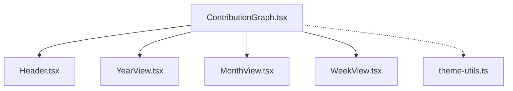

# Frontend Code Refactor Plan

This document outlines the refactoring plan for the Next.js frontend codebase in the `gymgit` project. The primary goal is to split large, monolithic component files into smaller, modular, and single-responsibility sub-components, making the codebase easier to read, maintain, and test.

In accordance with user requirements:
- **No visual layout changes will be introduced.**
- **No styling modifications will be made.**
- **Component contracts, props, and overall behavior will be preserved.**

---

## 1. Overview of Monolithic Files

We have identified the following components as primary candidates for refactoring based on size and mixed concerns:

| Component File | Size | Key Issues / Mixed Concerns |
| :--- | :--- | :--- |
| [`ContributionGraph.tsx`](file:///c:/Users/salma/Development/Jiyu/CodingAgent/gymgit/frontend/components/ContributionGraph.tsx) | ~711 lines / 31.3 KB | Contains Year View (365 days), Month View, and Week View JSX grids, complex styling states (themes, grids), and internal data hooks in a single component. |
| [`PowerLevelChart.tsx`](file:///c:/Users/salma/Development/Jiyu/CodingAgent/gymgit/frontend/components/PowerLevelChart.tsx) | ~363 lines / 17.9 KB | Combines both weekly/monthly bar chart layouts, composite data calculations, and nested AnimeTierCard interactions. |
| [`PowerScoreGuideModal.tsx`](file:///c:/Users/salma/Development/Jiyu/CodingAgent/gymgit/frontend/components/PowerScoreGuideModal.tsx) | ~227 lines / 18.6 KB | Integrates the progression roadmap scrolling layout (left) and the scoring metrics cards (right) in one place. |
| [`WeeklyPlanModal.tsx`](file:///c:/Users/salma/Development/Jiyu/CodingAgent/gymgit/frontend/components/WeeklyPlanModal.tsx) | ~334 lines / 14.7 KB | Houses prebuilt split selectors, custom plan detail inputs, and tag additions/removals logic. |

---

## 2. Refactoring Plans

Below are the detailed proposed changes for each component.

### Component 1: `ContributionGraph`

We will decompose the monolithic graph view into separate sub-components housed in a dedicated sub-folder.



#### Proposed File Changes
- **[NEW]** [`theme-utils.ts`](file:///c:/Users/salma/Development/Jiyu/CodingAgent/gymgit/frontend/components/contribution-graph/theme-utils.ts)
  - Contains style themes (`THEMES`), color utilities (`getThemeForWorkout`), and tile background functions (`getTileBgColor`).
- **[NEW]** [`Header.tsx`](file:///c:/Users/salma/Development/Jiyu/CodingAgent/gymgit/frontend/components/contribution-graph/Header.tsx)
  - Displays the activity count headers and the timeframe toggles (365 Days, Month, Week).
- **[NEW]** [`YearView.tsx`](file:///c:/Users/salma/Development/Jiyu/CodingAgent/gymgit/frontend/components/contribution-graph/YearView.tsx)
  - Implements the 53-week horizontal commit-like grid layout and tooltips.
- **[NEW]** [`MonthView.tsx`](file:///c:/Users/salma/Development/Jiyu/CodingAgent/gymgit/frontend/components/contribution-graph/MonthView.tsx)
  - Implements the calendar grid layout for the current month.
- **[NEW]** [`WeekView.tsx`](file:///c:/Users/salma/Development/Jiyu/CodingAgent/gymgit/frontend/components/contribution-graph/WeekView.tsx)
  - Implements the 7-day responsive card grid layout for the current week.
- **[MODIFY]** [`ContributionGraph.tsx`](file:///c:/Users/salma/Development/Jiyu/CodingAgent/gymgit/frontend/components/ContributionGraph.tsx)
  - Reduced to:
    1. Prop validation (`ContributionGraphProps`).
    2. Date and timeframe data orchestration via `useMemo` hooks (Year/Month/Week data sets).
    3. State control for `timeframe` switching.
    4. Delegation of rendering to the corresponding sub-components.

---

### Component 2: `PowerLevelChart`

We will group the weekly and monthly charts, moving helper functions to an external utility file.

#### Proposed File Changes
- **[NEW]** [`power-chart-utils.ts`](file:///c:/Users/salma/Development/Jiyu/CodingAgent/gymgit/frontend/components/power-level/power-chart-utils.ts)
  - Houses the color/glow theme matching functions (`getPowerColorTheme`).
- **[NEW]** [`WeeklyProgress.tsx`](file:///c:/Users/salma/Development/Jiyu/CodingAgent/gymgit/frontend/components/power-level/WeeklyProgress.tsx)
  - Renders the weekly progress bar chart, mapping characters and tooltips.
- **[NEW]** [`MonthlyProgress.tsx`](file:///c:/Users/salma/Development/Jiyu/CodingAgent/gymgit/frontend/components/power-level/MonthlyProgress.tsx)
  - Renders the 12-month historical progress bar chart, mapping characters and tooltips.
- **[MODIFY]** [`PowerLevelChart.tsx`](file:///c:/Users/salma/Development/Jiyu/CodingAgent/gymgit/frontend/components/PowerLevelChart.tsx)
  - Serves as the outer container layout including the Swords heading, description, and the inline trigger modal. Imports and passes calculated datasets to `WeeklyProgress` and `MonthlyProgress`.

---

### Component 3: `PowerScoreGuideModal`

We will separate the modal into its roadmap layout and its metrics description panel.

#### Proposed File Changes
- **[NEW]** [`ProgressionPath.tsx`](file:///c:/Users/salma/Development/Jiyu/CodingAgent/gymgit/frontend/components/power-score-guide/ProgressionPath.tsx)
  - The left-hand side container holding the horizontal scroll roadmap with character portraits, tooltips, and stem nodes.
- **[NEW]** [`ScoringMetrics.tsx`](file:///c:/Users/salma/Development/Jiyu/CodingAgent/gymgit/frontend/components/power-score-guide/ScoringMetrics.tsx)
  - The right-hand side metrics descriptions (Consistency, Optimal Length, Split Variety, Momentum).
- **[MODIFY]** [`PowerScoreGuideModal.tsx`](file:///c:/Users/salma/Development/Jiyu/CodingAgent/gymgit/frontend/components/PowerScoreGuideModal.tsx)
  - Renders the `Dialog` wrapper structure (trigger, headers, close buttons) and includes `ProgressionPath` and `ScoringMetrics`.

---

### Component 4: `WeeklyPlanModal`

We will separate the custom split builder form from the main prebuilt selection list.

#### Proposed File Changes
- **[NEW]** [`PrebuiltPlanGrid.tsx`](file:///c:/Users/salma/Development/Jiyu/CodingAgent/gymgit/frontend/components/weekly-plan/PrebuiltPlanGrid.tsx)
  - Handles rendering the grid cards for existing splits (PPL, Upper/Lower, Full Body).
- **[NEW]** [`CustomPlanEditor.tsx`](file:///c:/Users/salma/Development/Jiyu/CodingAgent/gymgit/frontend/components/weekly-plan/CustomPlanEditor.tsx)
  - Handles the custom inputs for the plan name, description, and the category tags creation/deletion system.
- **[MODIFY]** [`WeeklyPlanModal.tsx`](file:///c:/Users/salma/Development/Jiyu/CodingAgent/gymgit/frontend/components/WeeklyPlanModal.tsx)
  - Acts as the parent backdrop overlay and dialog orchestrator, managing state values for saving.

---

## 3. Step-by-Step Implementation Roadmap

To avoid breaking compilation and to ensure seamless builds:

1. **Step 1: Extract Utilities**
   - Extract constants and functions to utility files first (`theme-utils.ts`, `power-chart-utils.ts`).
   - Re-import these utilities in the existing components and run tests to ensure logic is unaffected.
2. **Step 2: Component Decomposition**
   - Create subcomponents one by one in respective folders.
   - For example, create `YearView.tsx`, import it back into the original `ContributionGraph.tsx`, replace the inline code, and test.
3. **Step 3: Verification**
   - Perform static analysis checking for TypeScript errors (`npx tsc`).
   - Start the development server (`npm run dev`) and test layout consistency.

---

## 4. Verification Plan

### Build Check
- Run compilation checks on the frontend folder:
  ```powershell
  cd frontend
  npm run build
  ```
  *(Verifies no import paths or TypeScript contracts were broken.)*

### Visual & Interactive Check
- Compare before and after screenshots of the components:
  1. The 365 Days, Month, and Week view grids inside `ContributionGraph`.
  2. The custom category tag inputs in `WeeklyPlanModal`.
  3. The scrolling character path in `PowerScoreGuideModal`.
